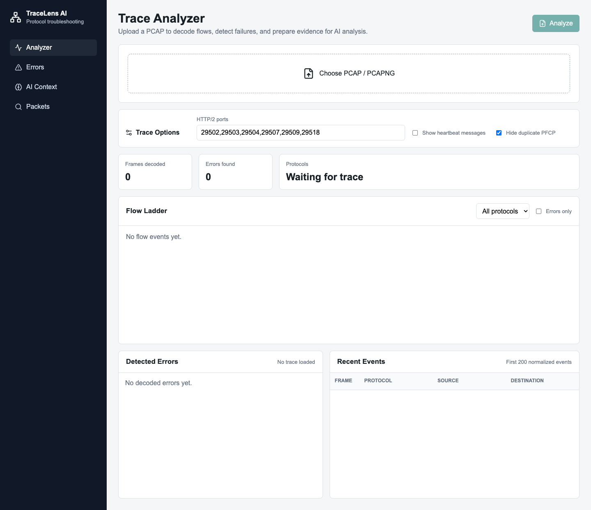
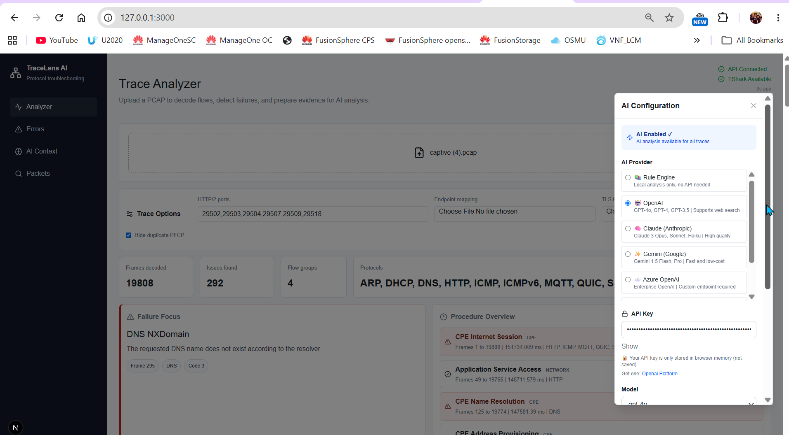
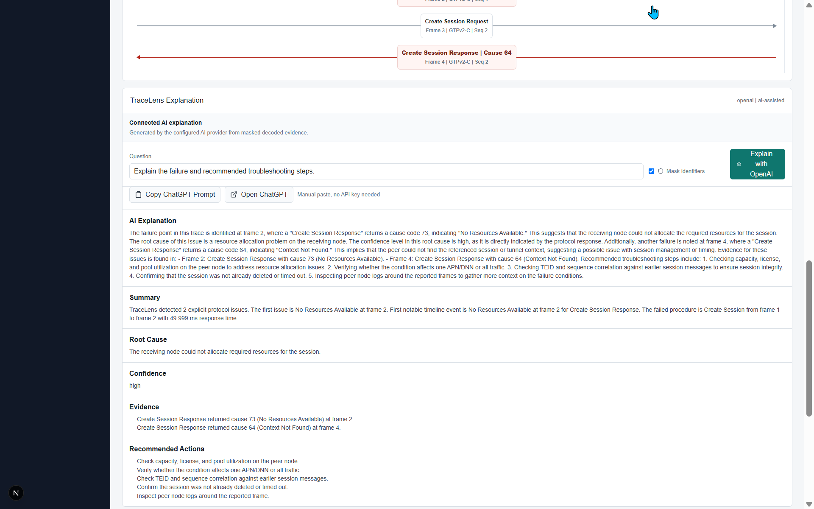

# TraceLens AI

AI-powered trace analyzer for telecom and network protocol troubleshooting.

TraceLens AI turns uploaded PCAP/PCAPNG files into readable protocol flows, detects errors with transparent rules, and prepares evidence-based context for AI analysis.



TraceLens decodes a real GTPv2-C session-setup failure, matches it to a known cause code, and explains it -- offline by default, or via a connected AI provider of your choice:

| Pick any AI provider (or none) | Live AI-generated explanation |
| --- | --- |
|  |  |

## 🚀 Quick Start

**New to TraceLens? Start here:** [QUICK_START.md](QUICK_START.md)

One-command startup options:
- **Mac/Linux:** `./start.sh` 
- **Windows:** `powershell -ExecutionPolicy Bypass -File start.ps1`
- **Docker:** `docker compose up --build`
- **Make:** `make start` or `make docker-start`

All options auto-configure everything and print URLs when ready.

## MVP Scope

- PCAP upload API
- Multiple PCAP upload and correlation
- TShark-based packet decoding
- Normalized event model
- Host and URL extraction from DNS, HTTP, TLS/QUIC hostname fields, SIP URI, and MQTT topic when present. TLS/QUIC HTTPS URLs are inferred as `https://host` unless decrypted HTTP evidence is available.
- GTPv2-C and Diameter starter extraction
- Rule-based error detection
- Local protocol knowledge library for error codes, likely root cause, recommended checks, and procedure grouping
- AI-ready trace summary payload, trimmed to a minimal, self-contained context so large traces don't blow past provider token/size limits
- AI explanation endpoint with offline fallback and multi-provider support: OpenAI, Claude (Anthropic), Gemini (Google), Azure OpenAI, Ollama (local), or any OpenAI-compatible custom endpoint
- TLS decryption via an uploaded `SSLKEYLOGFILE` keylog, when available, for full HTTP/2, HTTP, and application-layer visibility on TLS-wrapped sessions
- Endpoint mapping with manual YAML/JSON and Kubernetes pod YAML
- Next.js web interface for trace upload, protocol filtering, ladder flow review, frame details, error summary, and AI analysis with live API/TShark status indicators

## Target Protocols

Decoded with failure detection (root cause + recommended checks, not just labeling):

- GTPv1-C / GTPv2-C -- cause-code failure detection
- PFCP -- cause-code failure detection
- Diameter -- result-code failure detection
- NGAP (5G RAN-CN, 3GPP TS 38.413) -- Cause IE failure detection across all 5 cause categories (radioNetwork/transport/nas/protocol/misc), verified against a real free5GC registration capture
- S1AP (4G eNB-MME, 3GPP TS 36.413) -- same Cause IE structure as NGAP
- RADIUS -- Access-Reject / Disconnect-NAK / CoA-NAK detection
- DNS, HTTP, SIP, DHCP -- response-code failure detection
- TCP -- reset and retransmission detection
- TLS -- alert detection

Decoded and labeled, not yet checked for failures:

- GTP-U, SCTP, SNMP, LDAP, NTP, SMTP, POP3, IMAP, BGP, OSPF
- MQTT/QUIC/SSH traffic labeling
- ARP, ICMP

Not yet implemented (architecturally different from the binary-IE protocols above):

- NAS EPS / NAS 5GS -- typically opaque/ciphered octet strings inside S1AP/NGAP containers, needs different handling than a flat cause-code lookup
- HTTP/2 SBI (5G Service-Based Interface) -- 3GPP TS 29.500-series signaling carried as JSON bodies over HTTP/2, needs body inspection rather than binary IE parsing
- Any future protocol with a decoder and normalizer

CPE and internet-access traces are supported at a starter level with readable DHCP, DNS, TCP, TLS, HTTP, MQTT, QUIC, SSH, ICMP, and ARP event labels plus basic DHCP/DNS/TCP/TLS/HTTP issue detection.

## Architecture

```text
PCAP Upload
  -> Decode Worker
  -> TShark JSON
  -> Protocol Normalizer
  -> Flow Correlator
  -> Rule Engine
  -> AI Context Builder
  -> UI Report + AI Assistant
```

## Local Development

For full setup instructions, see [Installation Guide](docs/installation.md).

Requirements:

- Docker, optional
- TShark/Wireshark CLI for local decoder execution
- Node.js 20+
- Python 3.12+

Optional Docker backend stack:

```bash
docker compose up --build
```

Run the web app separately during development:

```bash
cd apps/web
npm install
npm run dev
```

Run the API locally:

```bash
cd apps/api
python -m venv .venv
source .venv/bin/activate
pip install -r requirements.txt
uvicorn app.main:app --reload
```

## AI Design

TraceLens is local-knowledge first and AI second. The decoder, normalizer, error-code library, and procedure rules produce the baseline troubleshooting result before any AI provider is used.

Local knowledge lives in:

- `apps/api/app/knowledge/error_codes.yaml`
- `apps/api/app/knowledge/procedure_rules.yaml`

AI receives structured, redacted trace evidence instead of raw PCAP bytes. Every AI answer should cite frame numbers and state when evidence is insufficient.

The API exposes `POST /analysis/explain`. Without an AI provider key, TraceLens returns the local rule-engine explanation so troubleshooting still works offline. When an AI provider is configured, the same endpoint sends the masked, size-trimmed AI context to the provider and includes the model answer beside the rule-engine baseline.

TraceLens is a provider gateway, not tied to one vendor. Supported providers, configurable per-request from the Settings panel (API keys stay in the browser, never persisted server-side):

- **OpenAI** (Responses API)
- **Claude (Anthropic)**
- **Gemini (Google)**
- **Azure OpenAI**
- **Ollama** (local models, no API key required)
- **Custom / generic** OpenAI-compatible endpoint (private enterprise gateways, local model servers, etc.)

Because the rule engine already computes root cause and recommended checks for every detected error, the prompt sent to any provider carries only those already-derived conclusions plus a couple of orientation fields -- not the full trace structure. This keeps even large-capture explanations well under typical provider size/token limits.

Optional web search is a separate switch. When enabled with the OpenAI provider, TraceLens can let the model use hosted web search for public references such as standards notes, vendor documentation, or known error-code context. Raw PCAP bytes are still not sent; the model receives only the structured, masked trace evidence.

If no API key is available, the in-app explanation comes from the local TraceLens rule engine. Use the ChatGPT Web handoff when you want external AI with a normal ChatGPT web account: after decoding a trace, click `Copy ChatGPT Prompt`, open https://chatgpt.com/, and paste the generated masked prompt. This keeps TraceLens usable without an API subscription while avoiding brittle browser automation.

Optional environment (server-side default provider; per-request provider/key selection from the UI takes precedence):

```bash
AI_PROVIDER=openai
AI_API_KEY=sk-...
AI_MODEL=gpt-5
AI_BASE_URL=https://api.openai.com/v1/responses
AI_WEB_SEARCH_ENABLED=true
```

## Sample Capture Testing

TraceLens uses generated telecom samples for controlled failure tests and will use selected public captures for protocol regression coverage. See [docs/sample-capture-strategy.md](docs/sample-capture-strategy.md).

Curated 4G/5G sample metadata lives in [samples/external-captures.yaml](samples/external-captures.yaml). Download approved external captures locally with:

```bash
apps/api/.venv/bin/python samples/download_external_captures.py --technology 5G
apps/api/.venv/bin/python samples/download_external_captures.py --technology 4G
```

Downloaded captures are stored under `samples/external/` and are intentionally ignored by Git.

## License

MIT -- see [LICENSE](LICENSE).

Run deterministic smoke tests against local samples:

```bash
PYTHONPATH=apps/api apps/api/.venv/bin/python apps/api/scripts/smoke_test_samples.py
```
